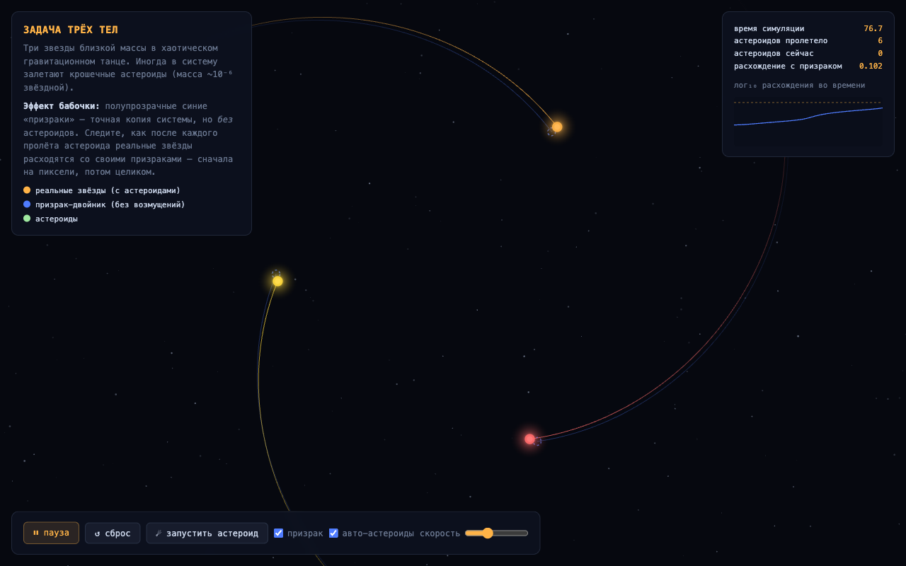

# 3body — watch the butterfly effect happen

**A self-contained, zero-dependency simulation of the three-body problem that makes chaos *visible*.**

Three suns of nearly equal mass locked in a gravitational dance. Every now and then a tiny asteroid — one **millionth** of a stellar mass — drifts through the system. That's the flap of a butterfly's wings. And you get to watch it tear the future apart.

**[▶ Live demo](https://k41n.github.io/3body/)** — one click, no install, no build step.



## The trick: a ghost universe

Most three-body simulations just show you pretty orbits. This one runs **two universes side by side**:

- 🟠 **The real system** — three stars *plus* every asteroid that wanders in.
- 🔵 **The ghost system** — an exact copy with identical starting conditions, same integrator, same time step… but **no asteroids, ever**.

At first the ghosts hide perfectly behind the real stars. Then an asteroid passes through — nudging each sun by a millionth of its mass — and the two universes begin to peel apart. Dashed lines stretch between each star and its ghost. A log-scale chart in the corner draws the signature of chaos in real time: **exponential divergence**, a straight line racing up the log plot, until the two futures share nothing but their past.

That is the butterfly effect. Not a metaphor — a measurement.

## Features

- **Real physics** — full N-body gravity integrated with classic **Runge–Kutta 4**, softened potential, momentum-corrected initial conditions near a perturbed Lagrange triangle (chaotic, but long-lived).
- **Ghost twin system** — the unperturbed control universe rendered as dashed outlines, with divergence lines and a live log₁₀ divergence chart.
- **Asteroids on demand** — they arrive on their own, or **click anywhere** to hurl one into the system yourself and personally ruin a deterministic future.
- **Adaptive camera** — smoothly zooms out when the stars fling each other wide, so the dance never leaves the frame.
- **Single HTML file** — no frameworks, no build, no network requests. Save the page, open it on a plane, it works.

## Controls

| Control | Effect |
|---|---|
| **Click** the canvas | launch an asteroid from that point toward the system |
| ⏸ / ▶ | pause / resume |
| ↺ | reset both universes to identical initial conditions |
| ☄ | launch a random asteroid |
| «призрак» | toggle the ghost universe overlay |
| «авто-астероиды» | toggle automatic asteroid arrivals |
| speed slider | simulation steps per frame |

## Run locally

```sh
git clone https://github.com/k41n/3body.git
open 3body/index.html        # macOS — or just double-click it
```

That's it. There is no step two.

## The physics, briefly

The three-body problem has no general closed-form solution — Poincaré proved in 1890 that it doesn't merely resist analysis, it is *chaotic*: nearby trajectories separate exponentially fast, at a rate given by the system's Lyapunov exponent. This simulation puts a number and a picture on that statement:

- Both universes are advanced by the same RK4 integrator with `dt = 0.002` and a softening length to avoid singular close encounters.
- The divergence metric is the root-sum-square positional distance between each real star and its ghost.
- Plotted on a log axis, chaotic divergence appears as a straight climbing line — the slope *is* the Lyapunov exponent. Watch it restart every time you feed the system another butterfly.

An asteroid of relative mass 10⁻⁶ shifts a star's velocity almost immeasurably. Chaos does the rest: each close three-body encounter roughly multiplies the accumulated error, and within a few dynamical times the perturbed and unperturbed futures are macroscopically different worlds.

## License

[MIT](LICENSE)
